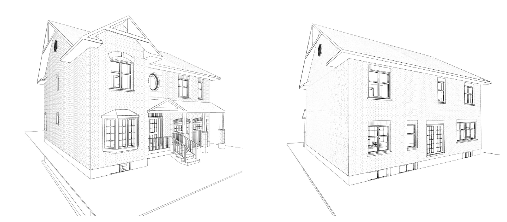

# Proposed metrics to control overheating risks <br />in future residential energy codes #

>  Julia Purdy (julia.purdy@canada.ca), Chris Kirney & Alex Ferguson, <br />
>  CanmetENERGY Ottawa, Natural Resources Canada
>
>  Version of April 29, 2019. <br />This is a draft document, and reflects interim findings from a ongoing study. <br />Documentation and relevant project files are maintained at https://github.com/NRCan-IETS-CE-O-HBC/HTAP-projects

[TOC]

## Synopsys ##

These files are part of an investigation into overheating in residential housing. The goal of this study is to propose a metric for evaluating the likelihood of a home to overheat relative to the reference house. Results from this study will also demonstrate how code requirements based on that metric would affect home design. 

## Background ##

Performance compliance may encourage designers to increase solar gains through windows as a low-cost means to reduce energy consumption. If designers do not consider the implications of adverse gains in summer, these homes may require significant cooling loads, and may be uncomfortable in summer. 

#### Hypothesis ####

*By comparing the **a) peak cooling loads** and/or **b) seasonal cooling requirements** between the proposed design and the reference house, a future code requirement can limit the likelihood that designers will use excessive solar gains to meet higher energy tiers.* 

#### Objectives:  ####

1. Propose a requirement limiting a designer's ability to trade-off reduced heating for increased cooling loads as a means to meet upper tiers
2. Develop evidence supporting that requirement, and identifying how the requirement is likely to limit home design. 

#### Guiding principles: ####

-  **The scope of this study is limited to home design** (orientation, glazing areas, overhangs), glazing specifications (solar heat gain coefficient), and operable windows. 
-  If proposed requirement stipulates the home be modelled with cooling, **these modelling procedures shall only be required for the purposes of assessing overheating risks**. They shall not be interpreted to mean that the code requires homes be equipped with air conditioners, or that the home shall

>  **NOTE**: The scope of this study specifically excludes examining whether or not a home will require cooling, or appropriate performance levels for cooling equipment. The metrics proposed in this study, and the data collected to support them will be inadequate to examine these other issues. If they are important for future codes, additional studies will be required.

-  **The metric will be computed using the reference house approach**. We recognize that housing design tools predict cooling with different degrees of accuracy. As part of this with the requirement, the designer must compare the cooling loads for the proposed design to those of the reference house. If the the proposed design's predicted cooling loads do not exceed the reference house by more than ==X%==, then the home will be deemed to comply with this requirement. 
-  **The requirement shall not restrict appropriate passive solar design.** The metric (and threshold ==X%==) will be chosen to permit designers enough flexibility to design a home to well-known passive solar principles (south glazing =~ 4-6% of floor area, windows are protected by appropriate overhangs, N/E/W glazing is limited).

#### Possible language for the proposed requirement ####

1. The reference house and proposed design shall be modelled in accordance with 9.36.5

2. For the purposes of demonstrating the proposed design does not increase risks of overheating, models for both the reference house and proposed design shall be equipped with appropriately-sized[^1] space cooling equipment that serves all occupied spaces within the building.[^2]

3. The relative difference in cooling requirements between the reference house and the proposed design shall be calculated as follows: 
   $$
   \delta QC = \frac{QC_{proposed}-QC_{reference}}{QC_{reference}}\cdot 100
   $$
   Where:
   
   $\delta{}QC$ is the  relative difference in the cooling requirements between the reference and proposed houses
   
   $QC_{proposed}$ is the  cooling requirement of the proposed house
   
   $QC_{reference}$ is the  cooling requirement of the reference house
   

<!-- Note that QC to be explicitly defined as Peak cooling load (W) or seasonal cooling requrement (GJ), based on findings from this study -->

4. The peak cooling load in the proposed design shall not exceed the peak cooling load in the reference house by more than ==X%==.

[^1]: Do we need to reference F280 here?
[^2]: The performance of the cooling equipment should be unimportant, because the requirement focuses on the peak cooling load, or seasonal cooling requirement.

## Method: ##

Using archetype homes, compare cooling requirements (peak loads, seasonal cooling requirements s for the reference house, for  the same house designed to well-known passive solar guidelines, and to worst case scenarios (E/W orientations, excessive, unshaded glazing). 

### Part a) Proposing the metric ###

#### STAGE 1: Effect of FDWR ####

Compare Cooling requirements for an archetype with different window to wall ratios. 

1. Run scenarios in Toronto; 
2. use results to propose a maximum ‘permitted increase in cooling loads’ threshold (e.g. 25%), which affords enough flexibility to design passive solar homes, but restricts ‘worst-case scenario’ homes. 
3. examine how that requirement would affect mid/high glazing scenarios. 
4. Run scenarios in other locations (suggested: Halifax, Winnipeg, Calgary, Edmonton, Kamloops, Vancouver, Yellowknife), and examine trends.

*QUESTIONS:* 

-  Should we use high-gain for this work? Passive solar results may be wonky otherwise.
-  What should passive solar overhangs be set to? Does HOT2000's window header height do what we think? 
   *ANSWER: Based on a very quick analysis and information from HOT2000 help, header height seems to be the overhang height above window*
   

###### Scenarios ######

A single archetype will be used for this work. 

Archetype specifications in HOT2000:

|                             |                                                              |
| --------------------------- | ------------------------------------------------------------ |
| Heated Floor Area           | 216.3 m²                                                     |
| Wall Area                   | 272.67 m²                                                    |
| Total Window Area: 35.38 m² | Front: 13.67 m² (38.6 % of total window area on this facade)<br />Side: 2.68 m² (7.6% of total window area)<br />Rear: 19.03 m² (53.8 % of total window area) |

<!--Need to insert some statistics about hhe archetypes.-->



**Figure 1:** Front and rear elevations


**==Archetype oriented north (front) / south (rear), mid-gain windows (SHGC:  0.26)==**

| Scenario      | Proposed house                                               | Reference house                                              |
| ------------- | ------------------------------------------------------------ | ------------------------------------------------------------ |
| Typical       | **[pro-A-NS]**AZNEH Archetype 1, as is (12% FWDH?). no change to overhangs<br />Front Window (N): 13.67 m² (<br />Side Window (E): 2.68 m²<br />Rear Window (S): 19.03 m² | **[ref-A]** 17% FWDH. equal glass distribution (overhangs set to 0 as per 9.36)<br />All windows (N, E, S, W): 11.59 m² |
| Passive solar | **[pro-B-NS]**AZNEH Archetype 1, south glass = 6% of heated floor area, north glass limited, appropriate overhangs (distribution changes relative to original ANZEH)<br />Front Window (N): 2.68 m²<br />Side Window (E): 2.68 m²<br />Rear Window (S): 12.98 m²<br />Rear Overhang Width: 1.5 m²<br />Rear Overhang Spacing: 1.12 m² <!--https://susdesign.com/overhang_annual/index.php--> | **[ref-A]**17% FWHR, equal glass distribution                |
| Mid glazing   | **[pro-C-NS]**AZNEH Archetype 1, glass increased to 20% FWDH, glass distribution proportional to original design. no change to original overhangs.<br />Front Window (N): 19.96 m²<br />Side Window (E): 4.14 m²<br />Rear Window (S): 29.33 m²<br /> | **[ref-C]** 20% FWHR, equal glass distribution<br />All windows (N, E, S, W): 13.63 m² |
| High glazing  | **[pro-D-NS] **AZNEH Archetype 1, glass increased to 25+% FWDH, glass distribution glass distribution proportional to original design. no change to original overhangs.<br />Front Window (N): 24.95 m²<br />Side Window (E): 5.18 m²<br />Rear Window (S): 36.67 m² | **[ref-D]** 22% FWHR, equal glass distribution<br />All windows (N, E, S, W): 15 m² |


#### STAGE 2: Effect of of orientation ####

Compare Cooling requirements for an archetype with different window to wall ratios. 

1. Rotate archetypes as noted, run scenarios in all locations. 
2. examine suitability of proposed metric in discouraging homes with wrong orientation. 

###### Scenarios ######

**==Archetype rotated to east (front) / west (rear)  mid-gain windows (SHGC:  0.26)==**

| Scenario                         | Proposed house                                              | Reference house                                |
| -------------------------------- | ----------------------------------------------------------- | ---------------------------------------------- |
| Typical EW                       | **[pro-A-EW]** AZNEH Archetype 1, pro-A variant rotated E/W | **[ref-A]** 17% FWDH. equal glass distribution |
| Passive solar, wrong orientation | **[pro-B-EW]** AZNEH Archetype 1, pro-B variant rotated E/W | **[ref-A]**17% FWHR, equal glass distribution  |
| Mid glazing, E/W                 | **[pro-C-EW]** AZNEH Archetype 1, pro-D variant rotated E/W | **[ref-C]** 20% FWHR, equal glass distribution |
| High glazing, E/W                | **[pro-D-EW] **AZNEH Archetype 1, pro-D variant rotated E/W | **[ref-D]** 22% FWHR, equal glass distribution |

#### STAGE 3: Effect of SHGC ####

Compare Cooling requirements for archetypes with window scenarios. - Run all archetypes:

- modify window distribution to equal in each cardinal direction; this is the base case
- modify to have 6% window area (to heated floor area) on the south side of the house with the same overall window to heated floor area; this is the passive solar case
- modify archetype to maximize window area on east and west sides with same overall window to heated floor area; this is the worst case scenario

2. Propose a maximum ‘permitted increase in cooling loads’ threshold (e.g. 25%), which affords enough flexibility to design passive solar homes, but restricts ‘worst-case scenario’ homes. 
3. Verify that the threshold produces similar results across different building simulation software
4. Examine impact of the proposed metric using 240 archetypes in a variety of locations. For those that could not meet proposed requirements, identify characteristics that prevent the archetypes from meeting the requirement. 


### Part B) Comparing results across software ###

Examine cooling requirements thresholds for these archetypes with another program (EnergyPlus). Assess whether the proposed requirement will produce consistent outcomes across software. 

### Part C) Evaluate impact on home design ###

Using NRCan's 240 new housing archetypes, assess how these archetypes would be affected by the requirement. Identify which houses would comply, which would fail. Report on common characteristics of homes not complying. 

## Findings: ##


##  HTAP instructions: ##

Example run:

```
C:\HTAP-projects\NBC-tiered-code\solar-threshold-study> C:\htap\htap-prm.rb -r .\example.run -o C:\htap\HTAP-options.json -v -j -t 2 -c
```

 

<!-- more here-->


## Working notes ##

### Details from April 29 call.  ###

###### ARCHETYPES: ######

1. Base case - Equal windows on all facades, same window area as ANZEH
2. Scenario - 1: Passive solar: 6% window distribution, overhangs on south side, north windows smaller. 
3. Scenario 3: Worst case: area moved to east/ west. 

##### FDWR: (Fenestration & Door to Wall area ratio) -  #####


$$
FDWR = \frac{Window~area + wall~area}{gross~area~ofall~walls~attached~to~conditioned~spaces}
$$


