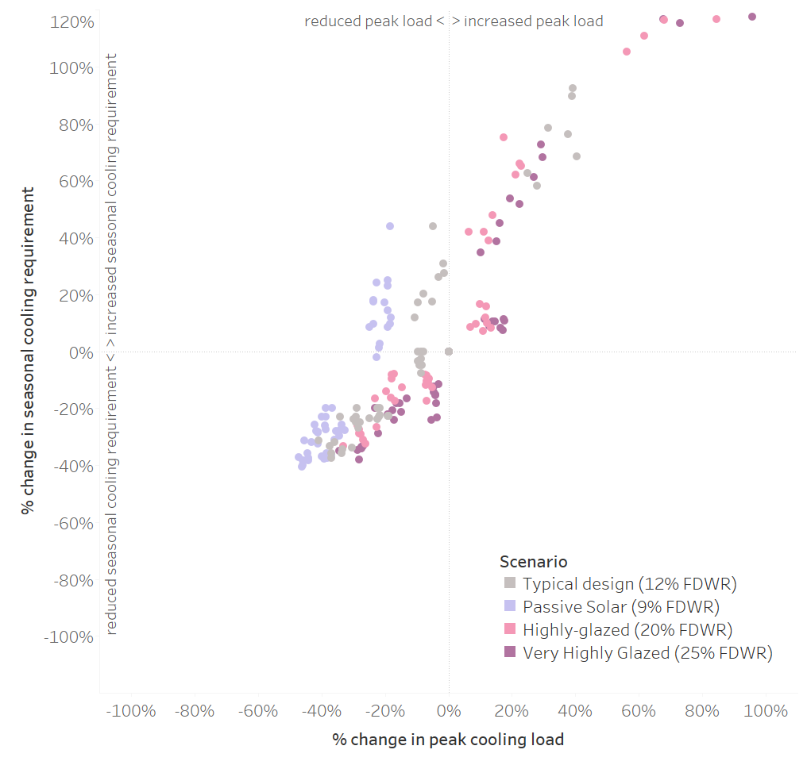
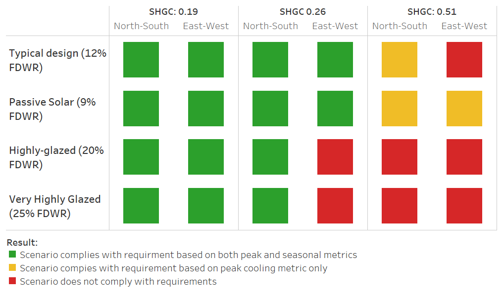

# Proposed metrics to control overheating risks <br />in future residential energy codes #

>  Julia Purdy (julia.purdy@canada.ca), Chris Kirney, Rasoul Asaee & Alex Ferguson, <br />
>  CanmetENERGY-Ottawa, Natural Resources Canada
>
>  Version of May 13, 2019. <br />This is a draft document, and reflects interim findings from a ongoing study. <br />Documentation and relevant project files are maintained at https://github.com/NRCan-IETS-CE-O-HBC/HTAP-projects

[TOC]

## Summary of Findings ##

These files are part of CE-O's investigation into the risks of overheating in residential housing. The goal of this study is to propose a metric for evaluating the likelihood of a home to overheat relative to the reference house. Results from this study will also demonstrate how code requirements based on that metric would affect home design. 

#### Key findings: ####

-  Both the **peak cooling load** and the **seasonal cooling requirement** are useful metrics for evaluating the risk of overheating

-  The **peak cooling load** appears to be the more suitable of the two metrics because it permits traditional passive solar design. 

-  By requiring proposed designs demonstrate peak cooling loads are ==equal-to or lower-than those of the reference house==, future performance codes will reduce the likelihood that homes complying with the performance compliance pathway. 

-  Such a requirement is unlikely to affect typical or passive-solar-optimized home design.

-  This requirement will affect design choices in homes with high window areas.  In such homes, the requirement can be met by choosing low-solar gain windows.  Reducing window area, relocating east and west facing windows to north and south facades, and installing overhangs will also help homes comply.  


#### Recommendations: ####

-  NBC section 9.36.5 should require that proposed designs demonstrate peak cooling loads equal-to or lower-than those of the reference house. 
-  CE-O recommends against permitting builders to install air-conditioning as an alternate means of compliance. 

## Background ##

Performance compliance may encourage designers to increase solar gains through windows as a low-cost means to reduce energy consumption. If designers do not consider the implications of adverse gains in summer, these homes may require significant cooling loads, and may be uncomfortable in summer. 

#### Objectives:  ####

1. Propose a performance compliance requirement that will reduce the risks of overheating in homes, by limiting design choices that are well understood to contribute to overheating.[^1].
2. Develop evidence supporting that requirement, and identifying how the requirement is likely to limit home design. 

[^1]: These features include combinations of high-gain windows, high window-to-floor-area ratios, and windows oriented east and west. 

#### Guiding principles: ####

-  **The scope of this study is limited to home design** (orientation, glazing areas, overhangs) and glazing specifications (solar heat gain coefficient).
-  **The requirement shall not prescribe cooling.** The intent of this requirement is to reduce the risk of overheating from excessive solar gains.  Likewise, installation of air-conditioning equipment is not recommended an alternate compliance pathway. Builders shall  comply with this requirement by changing window orientations, areas and glazing specifications to reduce overheating potential.
-  If proposed requirement stipulates the home be modelled with cooling, **these modelling procedures shall only be required for the purposes of assessing overheating risks**. They shall not be interpreted to mean that the code requires homes be equipped with air conditioners.
-  **The metric will be computed using the reference house approach**. We recognize that housing design tools predict cooling with different degrees of accuracy. As part of this with the requirement, the designer must compare the cooling loads for the proposed design to those of the reference house. If the the proposed design's predicted cooling loads do not exceed the reference house then the home will be deemed to comply with this requirement. 
-  **The requirement shall not restrict appropriate passive solar design.** The metric will be chosen to permit designers enough flexibility to design a home to well-known passive solar principles (south glazing =~ 4-6% of floor area, windows are protected by appropriate overhangs, N/E/W glazing is limited).

>**NOTE**: The scope of this study specifically excludes examining whether or not a home will require cooling.  Nor does it consider appropriate performance levels for cooling equipment. Such requirements would require more investigation. 

#### Possible language for the proposed requirement ####

1. The reference house and proposed design shall be modelled in accordance with 9.36.5

2. For the purposes of demonstrating the proposed design does not increase risks of overheating, models for both the reference house and proposed design shall be equipped with appropriately-sized space cooling equipment that serves all conditioned spaces within the building.

3. The cooling requirement in the proposed design shall not exceed the cooling requirement of in the reference house. 

TG-EEHSB directed us to consider two possible metrics for estimated the cooling requirement:

1. The **peak cooling load** (kW), which describes the maximum rate of cooling required to maintain the house's conditioned spaces at constant set points within the summer season.
2. The **seasonal cooling requirement** (kWh), which describes the total amount of cooling that must be delivered to maintain the house's conditioned spaces at constant set points throughout the summer season.

Note that both the peak cooling load and seasonal cooling requirement focus on the cooling delivered to the house, and not the power demand or energy use of the cooling equipment. While some building simulation software may require that a model include cooling to compute these metrics, the performance of the cooling equipment has no impact on their calculation. 

## Method: ##

CE-O researchers used an archetype home to examine how solar gains compared to the NBC reference house for different glazing areas, different orientations, and different specifications for window gains. 

### Single Family Housing Archetype  ###

The archetype represents common single-detached market housing product. It has 304 m² of heated floor area (216 m² above grade).  As designed, the windows are predominately located on the front and back.  Figure 1 depicts its front and rear elevations. 


| Figure 1: Single detached housing archetype — front and rear elevations. |
| ------------------------------------------------------------ |
|                      |

For the purposes of this study, we modified the archetype home to create the following four variants. 

-  **Typical**: Home as is, with no changes to windows or overhangs.
-  **Passive solar:** Home reconfigured to concentrate windows on rear façade. Window areas adjusted to achieve 6% south-facing window to heated floor ratio. Appropriate overhangs added to all rear windows.[^2]
-  **Highly glazed**: Home reconfigured to increase overall window to wall ratio to 20%. Window distribution as per original (typical) archetype. 
-  **Very highly glazed:** Home reconfigured to increase overall window to wall ratio to 25%. Window distribution as per original (typical) archetype. 

[^2]:  Window overhang widths set to 1.5 m, window overhang spacing (vertical distance from upper edge of the window to the overhang) set to 1.1 m

Table 1 presents the window areas of each of these archetypes.  Each of these archetypes was compared a reference house of the same design, but with window areas and distributions as prescribed in NBC 9.36.5.15.[^3] Note that the window-to-wall ratio of the typical and passive solar variants are much lower than that of the NBC reference house. The minimum FDWR (17%) for the reference house implies 11 m² more window area than the typical market house, and nearly twice as much window area as the passive solar design. 

**Table 1: Window areas for archetype variants**

| Metric                                  |     Typical | Passive Solar | Highly Glazed | Very Highly Glazed |
| --------------------------------------- | ----------: | ------------: | ------------: | -----------------: |
| Front window area                       |     13.6 m² |        2.7 m² |          20.0 |            24.9 m² |
| Left window area                        |      2.7 m² |        2.7 m² |        4.1 m² |             5.1 m² |
| Right window area                       |           – |             – |             – |                  – |
| Rear window area                        |     19.0 m² |       18.3 m² |       29.3 m² |            36.6 m² |
| **TOTAL WINDOW AREA**                   | **35.3 m²** |   **23.6 m²** |   **53.4 m²** |        **66.8 m²** |
| Window-to-Wall Ratio                    |      12.9 % |         8.6 % |        19.6 % |             24.5 % |
| South window to heated floor area ratio |       6.2 % |         6.0 % |         9.6 % |               12 % |

[^3]: As per section 9.36.5.15 10): The Fenestration and door area to gross wall area ratio (FDWR) of the reference house shall be:  **i)** as per the proposed house, where its FDWR is between 17% and 22%, **ii)** 17%, where FDWR of the proposed house is less than 17%, or iii)  22%, where FDWR of the proposed house is greater than 22%. 

### Scenarios: Orientation  ###

We examined each of these four archetype variants in two orientations: 

-  **North-South**, in which the front of the house was oriented north, and the rear faced south.
-  **East-West**, in which the front of the home was oriented east, and the rear faced west.

Orienting the passive solar archetype east-west contravenes long-understood guidelines on solar design. Even so, the scenario is useful in this study as a means to understand overheating potential and consequences of the proposed metric.  In each case, the archetype variant was compared to the reference house, with windows equally distributed in N/S/E/W orientations. 

### Scenarios: Window specification ###

Each archetype variant was examined with three different window packages:

-  **High-solar-gain:** U-value: 1.6 W/m²K, SHGC: 0.51
-  **Mid-solar-gain**: U-value: 1.6 W/m²K , SHGC: 0.26
-  **Low-solar-gain**: U-value: 1.6 W/m²K , SHGC: 0.19

In each case, the archetype variants were compared to the reference house with a window meeting the U-value requirements of NBC table 9.36.2.7-A, and a SHGC of 0.26.


### Consistency across building simulation software ###

==To be completed== Examine cooling requirements thresholds for these archetypes with another program (EnergyPlus). Assess whether the proposed requirement will produce consistent outcomes across software. 

### Impact on home design ###

==To be completed== Using NRCan's 240 new housing archetypes, assess how these archetypes would be affected by the requirement. Identify which houses would comply, which would fail. Report on common characteristics of homes not complying. 

## Findings: ##

### 1. Suitability of the reference house for performance codes ###

CE-O's analysis suggests that the 9.36.5 reference house does not represent current construction practices. There are two key differences between the reference house's window specifications and practice in market home building:

1. The reference house window-to-wall ratio range (17-22%) is much higher than the typical housing archetype used in this study (12%).  When the home was redesigned according to passive-solar principles, the window-to-wall ratio was 8.6%. These inconsistencies mean that the reference home will consistently exhibit higher heat loss, and higher solar gains than proposed homes. 
2. The reference house distributes windows equally in N/E/W/S orientations, while many contemporary homes locate windows predominately on the front and back. By redistributing windows to east and west locations, the reference house may effectively increase cooling budgets for highly-glazed homes with predominately south-facing glass. 

These discrepancies reflect the fact that the current 9.36.5 reference house was designed as a benchmark for seasonal heating requirements, without consideration of its use in overheating analysis. CE-O did not contemplate potential improvements to the reference house in the current scope, but such changes should be examined in the future. 

>  **Recommendation:** Codes Canada should revisit the definition of the 9.36 reference house, and consider changes to improve its alignment with contemporary housing. 

### 2. Metrics for overheating ###

The **peak cooling load** and the **seasonal cooling requirement** correlate well when compared for different window specifications, orientations and glass ratios. Figure 2 compares these two metrics for the various combinations examined in this study. Generally, increases in peak load area accompanied by increases in seasonal cooling requirement, and vice-versa. However, the results from the typical and passive solar scenarios show that in some cases, reductions in peak cooling load can be accompanied by increases in seasonal cooling requirement. These observations are limited to the typical design and passive solar scenarios, and only when the windows are equipped with high-gain (SHGC 0.51) windows. 

| Figure 2: Correlation between peak cooling load and seasonal cooling requirement, by scenario |
| :----------------------------------------------------------: |
|                      |

We assessed the suitability of these metrics by examining how a hypothetical overheating-limit requirement based on each metric would affect proposed designs. In each case, a proposed design was deemed to comply if its estimated peak cooling load or seasonal cooling requirement was less than or equal to the reference case. 

The results are depicted in Figure 3. Green blocks indicate scenarios that complied with both hypothetical metrics; while red blocks indicate scenarios that complied with neither. Yellow blocks indicate scenarios that comply with peak cooling requirement metrics, but which do not comply with the seasonal cooling requirements. 

| Figure 3: Scenario compliance with metrics based on peak cooling load and seasonal cooling requirement |
| :----------------------------------------------------------: |
|                      |

The results show that the proposed requirements effectively restrict use of high-gain windows on the very highly and very-highly glazed archetypes. Those same archetypes would be required to use low-gain windows when oriented east-west, but could meet the requirement with mid-glazed windows when oriented North-South. These results align with the intention of the proposed requirement: to limit use of high-gain glass in highly-glazed homes, and to encourage use of low gain glass in homes oriented east-west.

The results for the typical and passive-solar archetypes are especially interesting. Homes using low-gain and mid-gain windows comply with the requirement in all scenarios. Requirements based on both metrics also limit use of high-gain windows on the typical design archetype, when oriented east-west. The yellow squares indicate scenarios where the proposed design would comply if the requirement were based on peak cooling metric, but not the on the seasonal cooling metric.

The analysis shows that neither metric is perfectly suited to control risks of overheating:

- A requirement based on the seasonal cooling energy metric effectively restricts use of high-gain glass, in  all scenarios, including the passive-solar scenario with appropriate window orientation, window-to-floor-area ratios, and overhangs.
- A requirement based on the peak cooling load effectively permits high-gain windows on the appropriately-designed passive solar archetype. It also permits high-gain windows on the passive-solar archetype on the east-west scenario, and the typical design. Anecdotal evidence suggests that such homes are in fact at risk of overheating.    

At the outset of this study, we sought to identify a metric that would permit use of high-gain windows as part of appropriate passive solar design, but which would restrict use of those windows on east-west orientations. Neither metric exactly accomplishes this objective; the seasonal metric restricts all use of high-gain windows and the peak cooling metric permits use of high-gain windows in the passive solar archetype, even when that archetype is oriented east-west. 

We suspect that these contrary results may be attributable to the definition of the reference house in 9.36.5.  The reference house has a much higher window area than either of the typical or passive solar scenario. It also distributes these windows equally in all orientations. This means that the reference house generally has a higher cooling load than the typical and passive solar archetypes. The increased cooling budget permits design choices that will increase risks of overheating. 

Based on available information, we recommend that the overheating metric be based on the peak cooling load, because this approach will not restrict appropriate passive solar design. While this approach may not effectively control overheating risks in two scenarios considered (typical homes with high gain windows, and passive solar homes with high-gain windows and east-west orientation), we feel this compromise is better than a seasonal metric that may prohibit all high-gain windows. 

As mentioned earlier, the reference house should be reexamined for alignment with contemporary housing. Based on our analysis, we believe revising the reference  best way of improving the effectiveness of this requirement in for remaining scenarios with high risks of overheating. 

>  **Recommendation:** Codes Canada should add a requirement to the national building code to the effect of:
>
>  *"The peak cooling requirement of the proposed design shall not exceed that of the reference house"* 

### 3. Comparison across building simulation software ###

We assessed the peak cooling using HOT2000 (v11.6) and OpenStudio(EnergyPlus) for the each of the four variant scenarios identified in *Single Family Archetype* as well as the two orientations identified in *Scenarios: Orientation*.

- **Typical**: reference, N-S, E-W
- **Passive solar:** reference, N-S, E-W
- **Highly glazed**:reference, N-S, E-W 
- **Very highly glazed:** reference, N-S, E-W 

Each reference house has the same design, but with window areas and equal distribution (N/E/S/W) as prescribed in NBC 9.36.5.15.[^3]. Each orientation (N-S and E-W) identifies the direction of the front and back of the house. The archetype chosen has windows predominantly on the front and back of the house. 


The results of the analysis show that both HOT2000 and OS/E+ 

In addition to the base case window analysis, the analysis was completed with high gain, mid gain and low gain windows.


Green blocks indicate scenarios where the peak cooling predicted is less than the peak cooling predicted by the simulation tool for the 9.36 reference house. The side-by-side comparison of HOT2000 (H2K) and OS/E+ show that both tools show alignment for the scenarios considered.


### 4. Impact on home design.  ###

==To be completed==

## Expected outcomes ##

We expect the requirement will have the following outcomes if adopted in code:

-  Fewer homes will be prone to overheating due to excessive solar gains in the summer. However, some homes will still overheat — in part because of internal gains and humidity loads that are beyond the scope of this requirement. 
-  Builders will still be able to construct highly-glazed and very highly-glazed homes, provided they continue to comply with all other parts of the NBC. But builders of these homes will no longer be able to use high-solar-gain glass. If these homes feature significant amounts of windows facing east and west, builders will be required to install low-solar-gain windows.
-  Builders of typical, market-housing will no longer be able to use high-gain windows if those homes have predominate east or west facing glazing; they will have to opt for a mid-gain or low-gain instead. 
-  Appropriate passive solar design will not be restricted. Builders can continue to use high-gain windows provided that window areas are consistent with passive solar design principles, and they are protected by appropriate overhangs. 
-  Builders will have several measures that they can use to meet this requirement: reducing window area, re-locating east and west facing windows to south, and using low-solar-gain windows. 
-  Builders will not be required to install air-conditioning as an outcome of this requirement.  Builders will not be permitted to install air-conditioning as an alternate means to comply with this requirement. 

##  HTAP instructions: ##

The working files used in this analysis are stored in the HTAP-Projects Github repository: https://github.com/NRCan-IETS-CE-O-HBC/HTAP-projects/ . The path `NBC-tiered-code\solar-threshold-study`contains the relevant HTAP and HOT2000 files. 

HTAP users can recreate this analysis via the following command:

```powershell
C:\HTAP-projects\NBC-tiered-code\solar-threshold-study> C:\htap\htap-prm.rb `
                                                          -r .\htap-overheating-analysis.run `
                                                          -o C:\htap\HTAP-options.json `
                                                          -v -j -t 2 -c `
```

HOT2000 archetypes can be found in the `HOT2000_models`folder. The HOT2000 files are summarized in Table ==X==:

**Table ==X==: HOT2000 Archetype Files**

| Archetype Variant                                            | Proposed house .h2k files                                    | Reference house .h2k file                                    |
| ------------------------------------------------------------ | ------------------------------------------------------------ | ------------------------------------------------------------ |
| **Typical:** <br />12.9 % FDWR, overhangs as per original model soffit. | `pro-A-NS.h2k`:   rear oriented south<br />`pro-A-EW.h2k`:  rear oriented west | `ref-A.h2k`: 17% FWDH, equal glass distribution (N,E,W,S), overhangs set to 0 as per 9.36 |
| **Passive solar:** <br />8.6 % FDWR, overhangs as per passive solar guidelines | `pro-B-NS.h2k`:   rear oriented south<br />`pro-B-EW.h2k`:  rear oriented west | `ref-A.h2k`: as above                                        |
| **Mid glazing:**<br />19.6 % FDWR, overhangs as per original model soffit. | `pro-C-NS.h2k`:   rear oriented south<br />`pro-C-EW.h2k`:  rear oriented west | `ref-C.h2k`: 19.6% FWDH, equal glass distribution (N,E,W,S), overhangs set to 0 as per 9.36 |
| **High glazing:**<br />25.4% FDWR, overhangs as per original model soffit. | `pro-D-NS.h2k`:   rear oriented south<br />`pro-D-EW.h2k`:  rear oriented west | `ref-D.h2k`: 19.6% FWDH, equal glass distribution (N,E,W,S), overhangs set to 0 as per 9.36 |


## Working notes ##

### Details from April 29 call.  ###

###### ARCHETYPES: ######

##### FDWR: (Fenestration & Door to gross wall area ratio) -  #####


$$
FDWR = \frac{Window~area + wall~area}{gross~area~ofall~walls~attached~to~conditioned~spaces}
$$


