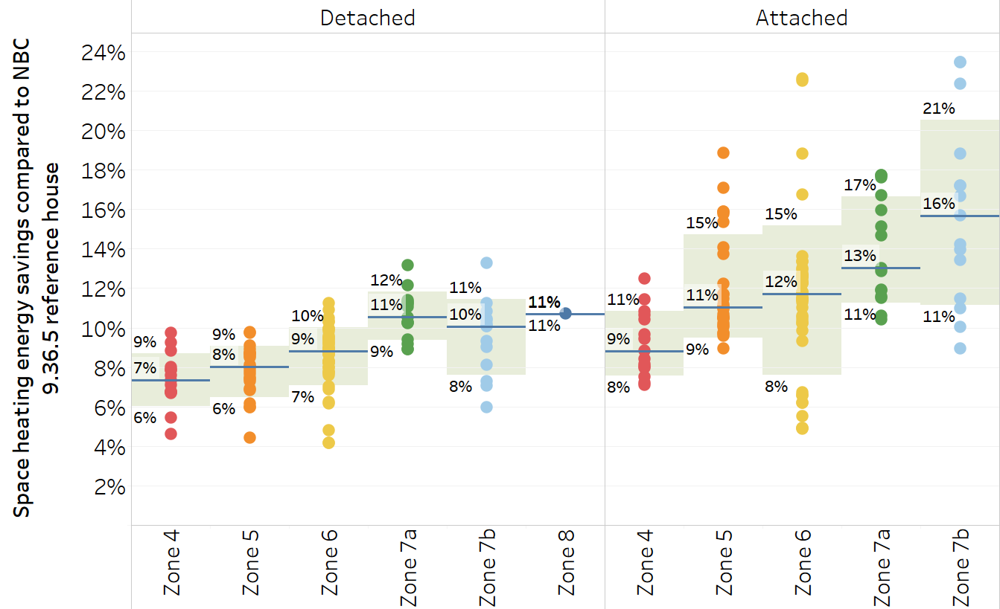
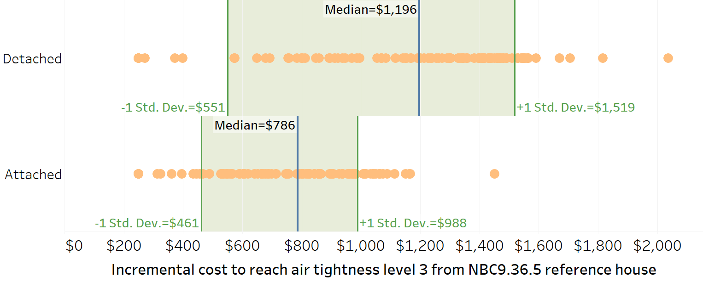
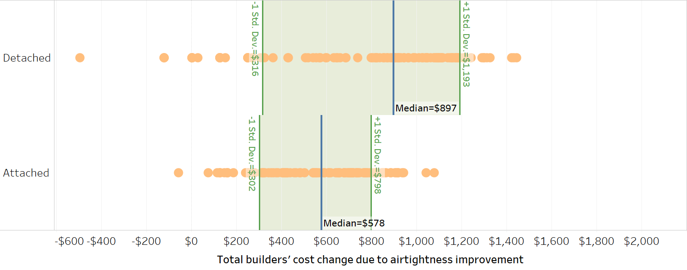

# Feasibility assessment of tiered performance codes

> Authors 
> CanmetENERGY-Ottawa, Natural Resources Canada
>
> Version of May 17, 2019.  This is a draft document, and reflects interim findings from a ongoing study.  Documentation and relevant project files are maintained at https://github.com/NRCan-IETS-CE-O-HBC/HTAP-projects

## Summary of Findings

## Background

### Objectives:

CE-O researchers investigated the feasibility of upgrading new Canadian homes to achieve the energy tiers proposed in PCF-1617. Our objectives were to: 

-  Determine if each of the energy energy tiers can be achieved using any or all of the energy conservation measures commonly used in Canadian low-energy construction
-  Identify regions and housing archetypes for which the tiers appear to be infeasible
-  Estimate cost ranges for achieving the energy tiers in different regions and energy requirements. 
-  If necessary, recommend changes to PCF-1617 to improve feasibility.

### Scope:

Our investigation into the feasibility of PCF-1617 included:

-  Examining how different air tightness targets would impact a home's envelope and overall performance improvement
-  Examining the likelihood that the envelope performance targets can be achieved using high-performance envelopes commonly used in low-energy and net-zero energy construction
-  Examining the likelihood that the overall performance targets can be met using broadly-available electric, gas, and oil-fueled heating equipment

==As part of this study, we considered a variety of archetypes, locations ...==

## Proposed Requirements for a tiered energy code

PCF 1617 proposes five energy tiers. The lowest tier aligns with the minimum requirements of NBC 9.36.  Each of the subsequent tiers sets forward performance requirements  

1. *Airtightness levels:* specific air-tightness targets that must be verified through a blower-door test.
2. *Envelope performance improvement:* Energy efficiency savings that must be achieved through envelope improvements alone (air-tightness, insulation, glazing, solar design), and demonstrated through performance modelling.
3. *Overall Performance improvement:* Energy efficiency savings that must be achieved through envelope and mechanical system improvements (excluding renewable energy systems), and demonstrated through performance modelling.

To comply with a given tier, a home must meet all of the requirements for that tier. Failure to meet any of the requirements for a given tier will cause a home to be deemed compliant with a lower tier. 

### Airtightness levels ###

A separate proposed change form (PCF 1610) defines 5 air-tightness performance levels, with ACH, NLA and NLR evaluation methods. For detached buildings, or for attached buildings/zones evaluated using guarded testing, the Air-tightness levels are defined as in Table 1.

###### Table 1: Air-tightness level definitions, single zones & attached zones tested using the guarded blower door test method. ######

| Air-Tightness Level | ACH @ 50 PA | NLA(10)  | NLR(50)     |
| :------------------ | :---------- | -------- | ----------- |
| 1                   | 2.5         | 1.20 cm² | 0.89 l/s/m² |
| 2                   | 2.0         | 0.96     | 0.71        |
| 3                   | 1.5         | 0.72     | 0.53        |
| 4                   | 1.0         | 0.48     | 0.35        |
| 5                   | 0.6         | 0.29     | 0.21        |

For attached zones evaluated using unguarded tsting, the Air-tightness levels are defined as in Table 2.

###### Table 2: Air-tightness level definitions, attached zones tested using the unguarded blower door test method. ######

| Air-Tightness Level | ACH @ 50 PA | NLA(10)  | NLR(50)     |
| :------------------------------------------------------ | :--- | :------- | :---------- |
| 0 | 3.0 | 1.92 cm² |1.17 l/s/m²|
|                                                       1 | 2.5 | 1.60 | 0.98 |
|                                                       2 | 2.0 | 1.28  | 0.78       |
|                                                       3 | 1.5 | 0.96 | 0.59       |
|                                                       4 | 1.0 | 0.64   | 0.39       |
|                                                       5 | 0.6 | 0.38     | 0.23       |

### Building envelope performance improvement ###

To comply with a tier, a home must meet its prescribed building envelope performance requirement. From PCF 1617:

> [**9.36.6.2 (5)**]  "*For the purpose of compliance with Tables 9.36.6.2.-A and -B, Envelope Performance Improvement is the **difference in energy use** between the proposed building and the reference building:*
>
>       *[a] including equipment, systems, and assemblies within the scope of 9.36.2., and*     *[b] excluding differences in mechanical equipment within the scope of 9.36.3. and 9.36.4."*

Note that this requirement is measured based on whole building performance (including space heating, hot water, ventilation, cooling), even though the effects envelope measures in the scope of 9.36.2 are largely limited to space heating.  [^a]

### Overall Performance improvement ###

To comply with a tier, a home must meet its prescribed building envelope performance requirement. From PCF 1617:

>  [**9.36.6.2 (4)**]  “*For the purpose of compliance with Tables
>9.36.6.2.-A and -B, Overall Energy Performance Improvement is the difference in energy use between the proposed
>  building and the reference building, expressed as a percentage of the total
>energy use of the reference building and excluding electrical base loads
>  related to lighting, plug loads and appliances (see note 9.36.6.2.(1)).*"

### Performance Tiers ###

Using those definitions, PCF 1617 defines the following performance tiers for: 

-  dwellings containing greater than 230m³ of conditioned space, and 
-  dwellings not containing greater than 230m³ of conditioned space.

###### TABLE 3: Performance tiers for dwellings containing greater than 230m³ of conditioned space ######

| Tier | Air-tightness level | Envelope Performance Improvement (%) | Overall Energy Performance Requirement (%) |
| ---- | ------------------: | -----------------------------------: | -----------------------------------------: |
| 1    |       Test only[^b] |                             $\geq 0$ |                                   $\geq 0$ |
| 2    |             Level 1 |                             $\geq 5$ |                                  $\geq 10$ |
| 3    |             Level 1 |                            $\geq 10$ |                                  $\geq 20$ |
| 4    |             Level 3 |                            $\geq 20$ |                                  $\geq 40$ |
| 5    |             Level 3 |                            $\geq 50$ |                                  $\geq 70$ |

###### TABLE 4: Performance tiers for dwellings  with conditioned space not greater than 230m³ ######

| Tier | Air-tightness level | Envelope Performance Improvement (%) | Overall Energy Performance Requirement (%) |
| ---- | ------------------: | -----------------------------------: | -----------------------------------------: |
| 1    |       Test only[^b] |                             $\geq 0$ |                                   $\geq 0$ |
| 2    |             Level 1 |                             $\geq 0$ |                                  $\geq 0 $ |
| 3    |             Level 1 |                             $\geq 5$ |                                  $\geq 10$ |
| 4    |             Level 3 |                            $\geq 15$ |                                  $\geq 30$ |
| 5    |             Level 3 |                            $\geq 35$ |                                  $\geq 60$ |

## Methodology & Findings

### Research Question #1)  *What contribution do the air-tightness levels make to the  Envelope and Overall Performance Requirements?* ###

Proposed tiers 4 and 5 require a home reach level 3 air-tightness (ACH 1.5 @ 50Pa). By implementing these measures, builders may make significant progress towards the envelope and overall performance targets. CE-O researchers investigated the impact of increasing air-tightness to level 3 in the representative archetypes ==(which ones? see Appendix A)==, and evaluated the contribution that air-tightness made to reaching the envelope improvement and overall performance improvement requirements.

#### HTAP Analysis ####

**Step 1 - ACH levels:** Configure and execute an HTAP run that:

-  Selects archetypes and locations as per appendix. 
-  Applies the 9.36 reference house ruleset, with electric resistance heating and an HRV[^c]
-  Configures base loads as per ERS requirements
-  Sets air-tightness to Level 1 (2.5 ACH) and Level 3 (1.5 ACH)

**Step 2 - Analysis:** Evaluate improvement in energy performance relative to reference house. Specifically examine: 

-  How close does air-tightness level 3 get a house to reaching tiers 4 and 5? 
-  Are impacts consistent across regions and archetypes?

#### Findings ####

...

| Figure 1. Overall performance improvement by reducing ACH to 1.5@50Pa while other parameters are held at the reference house level |
| :----------------------------------------------------------: |
|                       |

| Figure 2. Incremental cost for reducing the ACH to 1.5@50Pa for NBC9.36 reference house |
| :----------------------------------------------------------: |
|                                      |

| Figure 3. Total builders' cost change due to reduction of ACH to 1.5@50Pa while other parameters are held at the reference house level |
| ------------------------------------------------------------ |
|                               |

### Research Question #2)  *Is Tier 5 feasible in in all archetypes and regions?* ###

Proposed Tiers 4 and 5 imply ambitious levels of energy performance. While prior projects have demonstrated that these targets can be achieved in specific cases, their feasibility in all archetypes and in all locations remains uncertain. To evaluate the feasibility of these tiers, CE-O examined the net improvement in the homes' envelope and overall energy performance when the homes were upgraded to the most-efficient options commonly available on the market. 

###### TABLE 5: Specifications for most-efficient upgrade options ######

| Measure           | Component                   | Most Efficient Specification                                |
| ----------------- | --------------------------- | ----------------------------------------------------------- |
| Envelope options  | Air-tightness               | Air-tightness level 5 (0.6 ACH)[^d]                         |
|                   | Ceiling / Attic insulation  | Attic: R-80 Flat/Cathedral: R-40                       |
|                   | Above Grade Wall            | R-40 Effective (2x6 w/R24 Batt, 4.5 in XPS)                 |
|                   | Below-grade Wall            | R-22 Effective                                              |
|                   | Floor Header                | R-29 Effective                                              |
|                   | Window                      | Triple, low-e, U: 1.14, low gain                            |
|                   | Exposed Floor               | R-36 Effective                                              |
|                   | Foundation walls            | ==(include exterior and interior spec)==                    |
|                   | Foundation Slab on Grade    | R-27.5 Effective (5.5" xps)                                 |
|                   | Foundation Slab below grade | R-22.5 Effective (4.5" xps)                                 |
| Equipment options | Heating / Cooling           | Gas: 96% AFUE Electric:  CCASHP                        |
|                   | DHW                         | Gas:  EF 0.95  Electric: HPHotWater, EF: 0.9, COP: 2.6 |
|                   | HRV                         | SRE 78%                                                     |
|                   | Drain-water heat recovery   | N/A                                                         |

#### HTAP Analysis ####

**Step 1 - Envelope:** Configure and execute an HTAP run that:

-  Selects archetypes and locations as per appendix. 

-  Applies the 9.36 reference house ruleset, with electric and gas heating [^e] 

-  Configures base loads as per ERS requirements

-  Applies all of the most-efficient envelope options  in Table 5.

**Step 2 - Overall performance:** Using step 1 as a stating point, configure and execute an HTAP run that also: 

   -  Apply the most-efficient equipment  specifications in Table 5

**Step 3 - Analysis:** Examining the results from steps 1 and 2, determine: 

-  Can all of the performance tiers be met by all archetypes, and in all locations? 
-  If not, which ones fail, and why ? What are the maximum tiers that we can achieve?
-  Do we need to add even more efficient measures to the HTAP database? 
-  Is the definition of the envelope performance improvement workable? Or are changes needed?

#### Findings ####

Step 1 - Envelope

### Research Question #3)  *How much will it cost to reach each tier?* ###

CE-O's prior optimization research shown there are many different ways that we can upgrade homes to meet performance criteria, and that the range of solutions can vary widely by cost. Our experience also shows that the lowest-cost solutions are not necessarily the best ones, and that different builders may choose packages to achieve the same outcome. 

CE-O explored the cost impacts of each tier using a packaged upgrade approach. In this work, CE-O proposed a sets of packaged upgrades that are expected to achieve energy savings that approximate the targets for the various performance tiers. We selected these packages to correspond to three different approaches to home design:

1. The **envelope-first** approach, which prioritizes improvements to air-sealing and insulation over equipment upgrades, and chooses simpler equipment when possible. 
2. The **efficient-equipment** approach, which balances envelope upgrades with most-efficient equipment. 
3. The **gas-heating** approach, which selects envelope and mechanical upgrades with the intent of using natural gas as the primary heating fuel. 

###### Table 6: Envelope First packages ######

| Component                   | B: ~10%  | C: ~20%  | D: ~40%  | E: ~70%  |
| --------------------------- | -------- | -------- | -------- | -------- |
| Air-tightness               | 2.0 ACH  | 1.5 ACH  | 1.0 ACH  | 0.6 ACH  |
| Ceiling / Attic insulation  |          |          |          |          |
| Above Grade Wall            |          |          |          |          |
| Below-grade Wall            |          |          |          |          |
| Floor Header                |          |          |          |          |
| Exposed Floor               |          |          |          |          |
| Foundation walls            |          |          |          |          |
| Foundation Slab on Grade    |          |          |          |          |
| Foundation Slab below grade |          |          |          |          |
| Heating / Cooling           | NBC 9.36 | NBC 9.36 | NBC 9.36 | NBC 9.36 |
| DHW                         | NBC 9.36 | NBC 9.36 | NBC 9.36 | NBC 9.36 |
| HRV                         | NBC 9.36 | NBC 9.36 | NBC 9.36 | NBC 9.36 |
| Drain-water heat recovery   |          |          |          |          |

###### Table 7: Efficient-Equipment Packages ######

| Component                   | B: ~10% | C: ~20% | D: ~40% | E: ~70% |
| --------------------------- | ------- | ------- | ------- | ------- |
| Air-tightness               | 2.0 ACH | 1.5 ACH | 1.5 ACH | 1.5 ACH |
| Ceiling / Attic insulation  |         |         |         |         |
| Above Grade Wall            |         |         |         |         |
| Below-grade Wall            |         |         |         |         |
| Floor Header                |         |         |         |         |
| Exposed Floor               |         |         |         |         |
| Foundation walls            |         |         |         |         |
| Foundation Slab on Grade    |         |         |         |         |
| Foundation Slab below grade |         |         |         |         |
| Heating / Cooling           |         | CCASHP? | CCASHP? | CCASHP? |
| DHW                         |         |         |         | HPWH?   |
| HRV                         |         |         |         |         |
| Drain-water heat recovery   |         |         |         |         |

###### Table 8: Gas heating packages ######

| Component                   | B: ~10%  | C: ~20%  | D: ~40%  | E: ~70%  |
| --------------------------- | -------- | -------- | -------- | -------- |
| Air-tightness               |          |          |          |          |
| Ceiling / Attic insulation  |          |          |          |          |
| Above Grade Wall            |          |          |          |          |
| Below-grade Wall            |          |          |          |          |
| Floor Header                |          |          |          |          |
| Exposed Floor               |          |          |          |          |
| Foundation walls            |          |          |          |          |
| Foundation Slab on Grade    |          |          |          |          |
| Foundation Slab below grade |          |          |          |          |
| Heating / Cooling           | 96% AFUE | 96% AFUE | 96% AFUE | 96% AFUE |
| DHW                         | EF 0.9+  | EF 0.9+  | EF 0.9+  | EF 0.9+  |
| HRV                         |          |          |          |          |
| Drain-water heat recovery   |          |          |          |          |

####  ####

#### Findings ####

## Expected Outcomes ##

## Notes ##

[^a]:   This definition may prove problematic.  Envelope improvements can only affect a building’s space heating and space cooling (if equipped) energy use. Builders are expected to reduce overall energy use by 35% or more, using measures that only affect a fraction of overall energy use. This approach will make it easier to hit envelope targets in colder locations, because space heating is a bigger fraction of overall energy impacts (see pictures below -- comparing the % impact of air tightness improvements relative to the NBC.). In warmer locations, builders will have to work harder to hit the envelope target .    Consider proposing alternative requirment based on space heating alone. 

[^b]: To comply with tier 0, builders must complete an air-tightness test, but are not required to demonstrate a performance value. 

[^c]: Do we need to evaluate gas/electric and hrv/no hrv paths here?\\
[^d]: Should we run lower air-tightness levels too, and comment on the importance of reaching ACH 5?
[^e]: Do we need to run oil too? Could also slim down runs a little by excluding locations where gas is not available. 

## Appendix A: Archetypes ##

### 1) Low rise Detached housing ###

-  NRCan 11 archetypes
-  NRCan 240 archetypes
-  Murb archetypes (BC)
-  Mobile home archetypes

##  Appendix B: Locations 

###### Table B: Select weather locations ######

| Zone |                                     | HDD   | Design Temp | DCDBT | DCWBT |
| ---- | ----------------------------------- | ----- | ----------- | ----- | ----- |
| 4    | VICTORIA, BRITISH COLUMBIA          | 2650  | -4          | 24    | 16.6  |
|      | VANCOUVER, BRITISH COLUMBIA         | 2825  | -7          | 28    | 19.5  |
| 5    | KAMLOOPS, BRITISH COLUMBIA          | 3450  | -23         | 34    | 19.9  |
|      | CHATHAM, NEW BRUNSWICK              | 3470  | -16         | 31    | 23.8  |
|      | TORONTO, ONTARIO                    | 3650  | -20         | 31    | 23    |
|      | LONDON, ONTARIO                     | 3900  | -18         | 30    | 23.5  |
|      | YARMOUTH, NOVA SCOTIA               | 3990  | -14         | 22    | 19.1  |
| 6    | HALIFAX, NOVA SCOTIA                | 4000  | -16         | 26    | 19.6  |
|      | MONTREAL, QUEBEC                    | 4200  | -23         | 30    | 22.9  |
|      | CHARLOTTETOWN, PRINCE EDWARD ISLAND | 4460  | -20         | 26    | 21.1  |
|      | LETHBRIDGE, ALBERTA                 | 4500  | -30         | 31    | 19    |
|      | OTTAWA, ONTARIO                     | 4500  | -25         | 30    | 22.9  |
|      | FREDERICTON, NEW BRUNSWICK          | 4670  | -24         | 29    | 21.9  |
|      | SAINT JOHN'S, NEWFOUNDLAND          | 4800  | -15         | 24    | 19.7  |
| 7a   | CALGARY, ALBERTA                    | 5000  | -30         | 28    | 17.2  |
|      | QUEBEC, QUEBEC                      | 5080  | -25         | 28    | 21.7  |
|      | EDMONTON, ALBERTA                   | 5120  | -30         | 28    | 18.8  |
|      | REGINA, SASKATCHEWAN                | 5600  | -34         | 31    | 21.2  |
|      | WINNIPEG, MANITOBA                  | 5670  | -33         | 30    | 22.9  |
|      | BRANDON, MANITOBA                   | 5760  | -33         | 30    | 21.6  |
| 7b   | PRINCE ALBERT, SASKATCHEWAN         | 6100  | -37         | 28    | 21    |
|      | SEPT ILES, QUEBEC                   | 6200  | -29         | 24    | 17.4  |
|      | WHITEHORSE, YUKON TERRITORY         | 6580  | -41         | 25    | 15.3  |
|      | GOOSE BAY, NEWFOUNDLAND             | 6670  | -31         | 27    | 19.2  |
| 8    | DAWSON CITY, YUKON TERRITORY        | 8120  | -50         | 26    | 15.6  |
|      | YELLOWKNIFE, NORTHWEST TERRITORY    | 8170  | -41         | 25    | 17    |
|      | INUVIK, NORTHWEST TERRITORY         | 9600  | -43         | 26    | 16.5  |
|      | IQALUIT, NUNAVUT                    | 9980  | -40         | 17    | 12.1  |
|      | RESOLUTE, NUNAVUT                   | 12360 | -42         | 11    | 8.5   |

| Province          | Weather Location | HDDs | CDDs |
| ----------------- | ---------------- | ---- | ---- |
| Alberta           | Calgary          | 5000 |      |
|                   | Edmonton         | 5120 |      |
|                   | Ford McMurry     | 6250 |      |
|                   | Lethbridge       | 4500 |      |
| British Columbia  | Victoria         | 2650 |      |
|                   | Vancouver        | 2825 |      |
|                   | Prince           |      |      |
|                   |                  |      |      |
|                   |                  |      |      |
|                   |                  |      |      |
|                   |                  |      |      |
|                   |                  |      |      |
|                   |                  |      |      |
|                   |                  |      |      |
|                   |                  |      |      |
|                   |                  |      |      |
| Yukon Territories | Whitehorse       |      |      |
|                   |                  |      |      |
|                   |                  |      |      |
|                   |                  |      |      |

## Appendix C: Envelope and Overall Performance Interpretation 

Two observations:

1. the wording of the envelope performance requirements is ambiguous. Wording in PCF 1617: 

   > [5]  For the purpose of compliance with Tables 9.36.6.2.-A and -B, Envelope Performance Improvement is the difference in energy use between the proposed building and the reference building
   >
   >   [a] including equipment, systems, and assemblies within the scope of 9.36.2., and
   >
   >   [b] excluding differences in mechanical equipment within the scope of 9.36.3. and 9.36.4.

This could be interpreted as:  (i) the difference in energy use between the proposed and reference buildings excluding the mechanical equipment energy - i.e., Total Energy - Mechanical Equipment Energy or (ii) the difference in energy use between the proposed and reference buildings where the proposed and reference houses have the *same* mechanical equipment energy. 

2. The metric **Energy Use** includes electrical base loads and mechanical equipment. The envelope upgrades will only impact the Heating and Cooling Energy Use; electrical base loads as well as domestic hot water, and ventilation loads will remain constant. It is suggested that the difference in proposed and reference house heating/cooling energy is instead used.

none of the archetypes meet tier 5 in any location with the most efficient upgrades. Archetype 1 only meets tier 3 for most of the country. Even an envelope upgrade package with R-80 walls and R-100 attic insulation does not meet the tier 5 requirements for envelope upgrade. 

Where the comparison is heating energy use only, the chart is quite different; all archetypes meet tier 5 except in the coldest areas of Canada.

