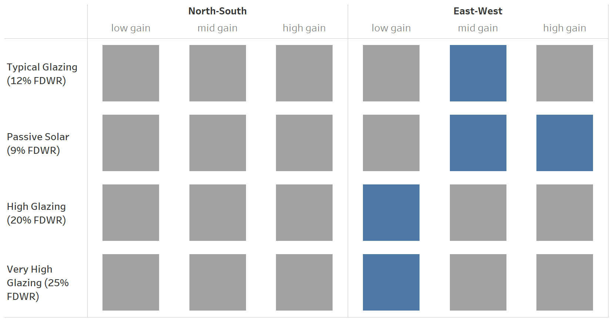
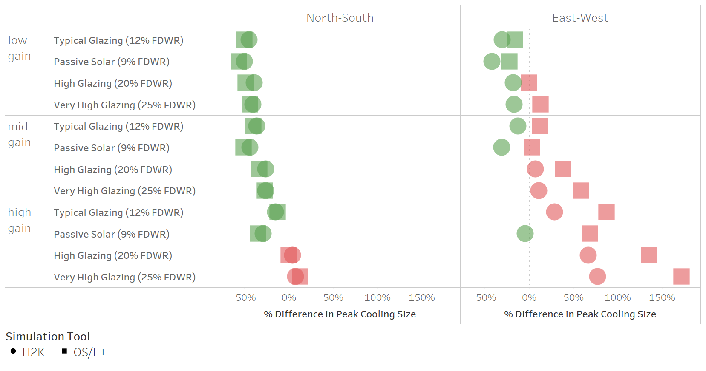
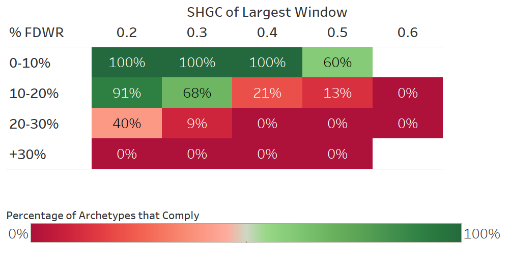

# Proposed metrics to control overheating risks <br />in future residential energy codes #

>  Julia Purdy (julia.purdy@canada.ca), Chris Kirney, Rasoul Asaee & Alex Ferguson, <br />
>  CanmetENERGY-Ottawa, Natural Resources Canada
>
>  Version of June 5, 2019. <br />Documentation and relevant project files are maintained at https://github.com/NRCan-IETS-CE-O-HBC/HTAP-projects


## Summary of Findings ##

These files are part of CE-O's investigation into the risks of overheating in residential housing. The goal of this study is to propose a metric for evaluating the likelihood of a home to overheat relative to the reference house. Results from this study will also demonstrate how code requirements based on that metric would affect home design. 

#### Key findings: ####

-  Both the **peak cooling load** and the **seasonal cooling requirement** are useful metrics for evaluating the risk of overheating

-  The **peak cooling load** appears to be the more suitable of the two metrics because it permits traditional passive solar design. 

-  By requiring proposed designs demonstrate peak cooling loads are **equal-to or lower-than those of the reference house**, future performance codes will reduce the likelihood that homes complying with the performance compliance pathway. 

-  Such a requirement is unlikely to affect typical or passive-solar-optimized home design.

-  This requirement will affect design choices in homes with high window areas.  In such homes, the requirement can be met by choosing low-solar gain windows.  Reducing window area, relocating east and west facing windows to north and south facades, and installing overhangs will also help homes comply.  


#### Recommendations: ####

-  NBC section 9.36.5 should require that proposed designs demonstrate peak cooling loads equal-to or lower-than those of the reference house. 
-  CE-O recommends against permitting builders to install air-conditioning as an alternate means of compliance. 

## Background ##

Performance compliance may encourage designers to increase solar gains through windows as a low-cost means to reduce energy consumption. If designers do not consider the implications of adverse gains in summer, these homes may require significant cooling loads, and may be uncomfortable in summer. 

#### Objectives:  ####

1. Propose a performance compliance requirement that will reduce the risks of overheating in homes, by limiting design choices that are well understood to contribute to overheating.[^1].
2. Develop evidence supporting that requirement, and identifying how the requirement is likely to limit home design. 

[^1]: These features include combinations of high-gain windows, high window-to-floor-area ratios, and windows oriented east and west. 

#### Guiding principles: ####

-  **The scope of this study is limited to home design** (orientation, glazing areas, overhangs) and glazing specifications (solar heat gain coefficient).
-  **The requirement shall not prescribe cooling.** The intent of this requirement is to reduce the risk of overheating from excessive solar gains.  Likewise, installation of air-conditioning equipment is not recommended an alternate compliance pathway. Builders shall comply with this requirement by changing window orientations, areas and glazing specifications to reduce overheating potential.
-  If proposed requirement stipulates the home be modelled with cooling, **these modelling procedures shall only be required for the purposes of assessing overheating risks**. They shall not be interpreted to mean that the code requires homes be equipped with air conditioners.
-  **The metric will be computed using the reference house approach**. We recognize that housing design tools predict cooling differently. As such, the designer must compare the cooling loads for the proposed design to those of the reference house. If the the proposed design's predicted cooling loads do not exceed the reference house then the home will be deemed to comply with this requirement. 
-  **The requirement shall not restrict appropriate passive solar design.** The metric will be chosen to permit designers enough flexibility to design a home to well-known passive solar principles (south glazing =~ 4-6% of floor area, windows are protected by appropriate overhangs, N/E/W glazing is limited).

>**NOTE**: The scope of this study specifically excludes examining whether or not a home will require cooling.  Nor does it consider appropriate performance levels for cooling equipment. Such requirements would require more investigation. 

#### Possible language for the proposed requirement ####

1. The reference house and proposed design shall be modelled in accordance with 9.36.5.

2. For the purposes of demonstrating the proposed design does not increase risks of overheating, models for both the reference house and proposed design shall be equipped with appropriately-sized space cooling equipment that serves all conditioned spaces within the building.

3. The cooling requirement in the proposed design shall not exceed the cooling requirement of in the reference house. 

TG-EEHSB directed us to consider two possible metrics for estimated the cooling requirement:

1. The **peak cooling load** (kW), which describes the maximum rate of cooling required to maintain the house's conditioned spaces at constant set points within the summer season.
2. The **seasonal cooling requirement** (kWh), which describes the total amount of cooling that must be delivered to maintain the house's conditioned spaces at constant set points throughout the summer season.

Note that both the peak cooling load and seasonal cooling requirement focus on the cooling delivered to the house, and not the power demand or energy use of the cooling equipment. While some building simulation software may require that a model include cooling to compute these metrics, the performance of the cooling equipment has no impact on their calculation. 

## Methodology: ##

CE-O researchers used an archetype home to examine how solar gains compared to the NBC reference house for different glazing areas, different orientations, and different specifications for window solar gains. We also examined how predictions about cooling loads could vary between different building simulation platforms

#### Single Family Housing Archetype ####

The archetype represents common single-detached market housing product. It has 304 m² of heated floor area (216 m² above grade).  As designed, the windows are predominately located on the front and back.  Figure 1 depicts its front and rear elevations. 


| Figure 1: Single detached housing archetype — front and rear elevations. |
| ------------------------------------------------------------ |
|                |

#### Glazed area scenarios ####

For the purposes of this study, we modified the archetype home to create the following four variants. 

-  **Typical**: Home as is, with no changes to windows or overhangs.
-  **Passive solar:** Home reconfigured to concentrate windows on rear façade. Window areas adjusted to achieve 6% south-facing window to heated floor ratio. Appropriate overhangs added to all rear windows.[^2]
-  **Highly glazed**: Home reconfigured to increase overall window to wall ratio to 20%. Window distribution as per original (typical) archetype. 
-  **Very highly glazed:** Home reconfigured to increase overall window to wall ratio to 25%. Window distribution as per original (typical) archetype. 

[^2]:  Window overhang widths set to 1.5 m, window overhang spacing (vertical distance from upper edge of the window to the overhang) set to 1.1 m

Table 1 presents the window areas of each of these archetypes.  Each of these archetypes was compared a reference house of the same design, but with window areas and distributions as prescribed in NBC 9.36.5.15.[^3] 

Note that the window-to-wall ratio of the typical and passive solar variants are much lower than that of the NBC reference house. The minimum FDWR (17%) for the reference house implies 11 m² more window area than the typical market house, and nearly twice as much window area as the passive solar design. 

###### Table 1: Window areas for archetype variants ######

| Metric                                  |     Typical | Passive Solar | Highly Glazed | Very Highly Glazed |
| --------------------------------------- | ----------: | ------------: | ------------: | -----------------: |
| Front window area                       |     13.6 m² |        2.7 m² |          20.0 |            24.9 m² |
| Left window area                        |      2.7 m² |        2.7 m² |        4.1 m² |             5.1 m² |
| Right window area                       |           – |             – |             – |                  – |
| Rear window area                        |     19.0 m² |       18.3 m² |       29.3 m² |            36.6 m² |
| **TOTAL WINDOW AREA**                   | **35.3 m²** |   **23.6 m²** |   **53.4 m²** |        **66.8 m²** |
| Window-to-Wall Ratio                    |      12.9 % |         8.6 % |        19.6 % |             24.5 % |
| South window to heated floor area ratio |       6.2 % |         6.0 % |         9.6 % |               12 % |

[^3]: As per section 9.36.5.15 10): The Fenestration and door area to gross wall area ratio (FDWR) of the reference house shall be:  **i)** as per the proposed house, where its FDWR is between 17% and 22%, **ii)** 17%, where FDWR of the proposed house is less than 17%, or iii)  22%, where FDWR of the proposed house is greater than 22%. 

#### Orientation Scenarios  ####

We examined each of these four archetype variants in two orientations: 

-  **North-South**, in which the front of the house was oriented north, and the rear faced south.
-  **East-West**, in which the front of the home was oriented east, and the rear faced west.

Orienting the passive solar archetype east-west contravenes long-understood guidelines on solar design. Even so, the scenario is useful in this study as a means to understand overheating potential and consequences of the proposed metric.  In each case, the archetype variant was compared to the reference house, with windows equally distributed in N/S/E/W orientations. 

#### Window Specification Scenarios ####

Each archetype variant was examined with three different window packages:

-  **High-solar-gain:** U-value: 1.6 W/m²K, SHGC: 0.51
-  **Mid-solar-gain**: U-value: 1.6 W/m²K , SHGC: 0.26
-  **Low-solar-gain**: U-value: 1.6 W/m²K , SHGC: 0.19

In each case, the archetype variants were compared to the reference house with a window meeting the U-value requirements of NBC table 9.36.2.7-A, and a SHGC of 0.26.


#### Consistency across building simulation software ####

To explore how outcomes from this requirement may be affected by different building simulation software, we modelled the same single family archetype in both HOT2000 and Open Studio / Energy Plus. This analysis included comparisons using the the same orientation, window specification and glazing ratio scenarios in both software.

#### Impact on home design ####

Finally, we examined the real-world impact of the proposed requirement using 240 different housing archetypes --- each of which representing a real-world home design. 

## Findings: ##

#### 1. Suitability of the reference house for performance codes ####

CE-O's analysis suggests that the 9.36.5 reference house does not represent current construction practices. There are two key differences between the reference house's window specifications and practice in market home building:

1. The reference house window-to-wall ratio range (17-22%) is much higher than the typical housing archetype used in this study (12%).  When the home was redesigned according to passive-solar principles, the window-to-wall ratio was 8.6%. These inconsistencies mean that the reference home will consistently exhibit higher heat loss, and higher solar gains than proposed homes. 
2. The reference house distributes windows equally in N/E/W/S orientations, while many contemporary homes locate windows predominately on the front and back. By redistributing windows to east and west locations, the reference house may effectively increase cooling budgets for highly-glazed homes with predominately south-facing glass. 

Not only does the the  9.36.5 reference house have more window area than the typical and passive solar archetypes — it also has more windows than typical residential construction. In 2019, CE-O researchers developed a set of 240 residential archetypes that represent the energy characteristics of contemporary housing. We developed these archetypes by sampling data from actual home audits under Natural Resources Canada's housing programs. Figure 2 plots the window-to-wall-ratio of the 240 archetypes relative to the 17-22% range prescribed for the NBC reference house. Most of the archetypes have FDWR ratios less than 17%, the lower bound of the NBC 9.36.5 reference house.  

| Figure 2: Distribution of window-to-wall ratio of the 240 archetypes, relative to 17-22% range of the NBC 9.36.5 reference house and 240 NRCan archetypes |
| :----------------------------------------------------------: |
|                  |

The disparity between the 9.36.5 reference house window area and contemporary housing will affect heating and cooling energy comparisons between the proposed and reference houses in the following manner:

-  Contemporary housing will generally have lower cooling loads than the reference house. This is because the reference house has greater window area, and windows are greater contributors to heat loss than opaque walls. 
-  Contemporary housing will generally have lower cooling loads than the reference house when oriented north and south, but higher loads when oriented east and west. This is because east and west windows  make greater contributors to cooling loads in summer.  

>  **Recommendation:** Codes Canada should revisit the definition of the 9.36 reference house, and consider changes to improve its alignment with contemporary housing. 

### 2. Metrics for overheating ###

Our analysis shows that the **peak cooling load** and the **seasonal cooling requirement** correlate well when compared for different window specifications, orientations and glass ratios. Figure 3 compares these two metrics for the various combinations examined in this study. Generally, increases in peak load are accompanied by increases in seasonal cooling requirement, and vice-versa. However, the results from the typical and passive solar scenarios show that, in some cases, reductions in peak cooling load can be accompanied by increases in seasonal cooling requirement. These observations are limited to the typical design and passive solar scenarios, and only when the windows are equipped with high-gain (SHGC 0.51) windows. 

| Figure 2: Correlation between peak cooling load and seasonal cooling requirement, by scenario |
| :----------------------------------------------------------: |
|                   |

We assessed the suitability of these metrics by examining how a hypothetical overheating-limit requirement based on each metric would affect proposed designs. In each case, a proposed design was deemed to comply if its estimated peak cooling load or seasonal cooling requirement was less than or equal to the reference case. 

Figure 4 depicts our results for the highly-glazed and very-highly-glazed scenarios.  Green blocks indicate scenarios that complied with both hypothetical metrics; red blocks indicate scenarios that complied with neither. Pink blocks indicate scenarios that comply with peak cooling requirement metrics, but which do not comply with the seasonal cooling requirements. 

| Figure 3: Scenario compliance with metrics based on peak cooling load and seasonal cooling requirement, highly-glazed and very-highly-glazed scenarios |
| :----------------------------------------------------------: |
|               |

The results show that the proposed requirement effectively restricts use of high-gain windows on the very highly and very-highly glazed archetypes, and that the outcomes are consistent when either the peak or seasonal cooling metric is used. Our analysis also shows that both metrics produce similar outcomes when low-gain glass is used, or when mid-gain glass is used on north-south orientations. 

However, outcomes from the two metrics differ somewhat for the mid-gain window scenario. Using either the peak load or seasonal requirement, we found all homes complied when oriented north-south. When oriented east-west, we found that the archetype could not comply with the  peak load metric in any of the locations, but would comply in some locations wen the seasonal metric was used. 

As expected, neither the highly-glazed or very-highly glazed archetypes could comply with the requirement with high-gain windows, regardless of orientation or metric used. 

Figure 4 presents the same data for the typical and passive solar design archetypes. In this graph, yellow blocks indicate scenarios that comply with peak cooling requirement metrics, but which do not comply with the seasonal cooling requirements. 

| Figure 4: Scenario compliance with metrics based on peak cooling load and seasonal cooling requirement, typical and passive-solar scenarios |
| :----------------------------------------------------------: |
|                 |

For the low-gain and mid-gain window scenarios, we found that both passive-solar and typical archetypes comply, regardless of orientation, location, or metric used. The high-gain results are more noteworthy:

-  Both the seasonal and peak metrics restricted use of high-gain windows on the **typical archetype**, when oriented east-west, regardless of orientation. The seasonal metric also restricted use of high-gain windows on north-south orientations, but the peak metric permitted them in all locations. 
-  The seasonal metric restricted use of high gain windows on the **passive solar archetype** when oriented east-west in all locations, and when oriented north-south, in some locations. The peak metric permitted use of high-gain windows on the passive solar archetypes in all locations when oriented north-south, and in some locations, when oriented east-west.

Table 2 summarizes our findings for the passive solar design archetype; Table 3 summarizes findings for the typical design archetype. 

###### Table 2: Comparison of outcomes using peak load and seasonal metrics for Passive Solar Design, High-Gain scenario ######

| Orientation | Peak load metric                                 | Seasonal metric                                   |
| ----------- | ------------------------------------------------ | ------------------------------------------------- |
| North-South | Permits use of high-gain glass in all locations  | Restricts use of high-gain glass in all locations |
| East-West   | Permits use of high-gain glass in some locations | Restricts use of high-gain glass in all locations |

###### Table 3: Comparison of outcomes using peak load and seasonal metrics for Typical design, High-Gain scenario ######

| Orientation | Peak load metric                                  | Seasonal metric                                   |
| ----------- | ------------------------------------------------- | ------------------------------------------------- |
| North-South | Permits use of high-gain glass in all locations   | Restricts use of high-gain glass in all locations |
| East-West   | Restricts use of high-gain glass in all locations | Restricts use of high-gain glass in all locations |


Our analysis shows that neither metric is perfectly suited to control risks of overheating:

- A requirement based on the seasonal cooling energy metric effectively restricts use of high-gain glass, in most scenarios. This includes passive-solar scenario with appropriate window orientation, window-to-floor-area ratios, and overhangs, which could not be designed in some locations. 
- A requirement based on the peak cooling load effectively permits high-gain windows on the typical and appropriately-designed passive solar archetype when oriented North-South. It also permits high-gain windows on the passive-solar archetype on the east-west scenario in some locations. Anecdotal reports suggests that such homes are in fact at risk of overheating.    

At the outset of this study, we sought to identify a metric that would permit use of high-gain windows as part of appropriate passive solar design, but which would restrict use of those windows on east-west orientations. Neither metric exactly accomplishes this objective:

-  In some locations, the seasonal metric restricts use of high-gain windows in the passive solar design when oriented east-west
-  In some locations, the peak cooling metric permits use of high-gain windows in the passive solar archetype, even when that archetype is oriented east-west. 

Based on available information, we recommend that the overheating metric be based on the peak cooling load, because this approach will not restrict appropriate passive solar design. While this approach may not effectively control overheating risks in two scenarios considered (typical homes with high gain windows, and passive solar homes with high-gain windows and east-west orientation), we feel this compromise is better than a seasonal metric that may prohibit all high-gain windows. 

As mentioned earlier, the reference house should be reexamined for alignment with contemporary housing. Based on our analysis, we believe revising the reference is the best way of improving the effectiveness of this requirement for remaining scenarios with high risks of overheating. 

>  **Recommendation:** Codes Canada should add a requirement to the national building code to the effect of:
>
>  *"The peak cooling requirement of the proposed design shall not exceed that of the reference house"* 

### 3. Comparison across building simulation software ###

We assessed the peak cooling using HOT2000 (H2K) and EnergyPlus/OpenStudio (OS/E+) for the each of the four variant scenarios identified in *Single Family Archetype* as well as the two orientations identified in *Scenarios: Orientation*. Each house was simulated for one location (Toronto) and one window (the appropriate NBC 9.36 reference window)

- **Typical**: reference, North-South, East-West
- **Passive solar:** reference, North-South, East-West
- **Highly glazed**:reference, North-South, East-West 
- **Very highly glazed:** reference, North-South, East-West 

Figure 4 shows the evaluation of the recommendation: *"The peak cooling requirement of the proposed design shall not exceed that of the reference house"* for each simulation tool. 

The % difference in peak cooling from the reference case is compared for each archetype variant and orientation with HOT2000 and OS/E+. The green blocks indicate that the predicted peak cooling is *less than the reference house*; red blocks indicate the predicted peak cooling is *exceeds the reference house*.  

| Figure 4: Comparisons of metric outcomes between HOT2000 and OS/E+ |
| :----------------------------------------------------------: |
|             |

The results show that HOT2000 and OS/E+ predict alignment in peak cooling for all North-South facing houses modelled, i.e. both H2K and OS/E+ predict peak cooling lower than the reference house.  

The results also show that HOT2000 and OS/E+ report the same trends in peak cooling for East-West "high glazing" and "very high glazing" cases; peak cooling that exceeds the reference. Both tools predict that highly and very highly glazed houses with the majority of their windows on the East-West sides have the potential for overheating.

The typical and passive solar scenarios for East-West orientation do not show the same clear alignment; OS/E+ predicts a slight <u>increase</u> in peak cooling from the reference house whereas HOT2000 predicts a slight <u>decrease</u> in peak cooling. 

The result of this analysis indicates that homes with lower total glazing (typical and passive solar) with the majority of those windows facing East-West could *meet* the target if modelled in HOT2000 and *not meet* the target if modelled in EnergyPlus.

 

In addition to the base case window analysis presented above, the analysis was completed with high gain, mid gain and low gain windows. The results of this analysis are shown in Figure 5; where the gray blocks indicate scenarios where HOT2000 and EnergyPlus are in alignment and the blue blocks are scenarios where they aren't.  

| Figure 5: Comparison of outcomes, Hot2000 and OS |
| :----------------------------------------------: |
|           |


These results confirm alignment between HOT2000 and EnergyPlus for all scenarios for archetype variants facing North-South. For archetype variants facing East-West, alignment between the two tools is shown for *low-gain windows with lower FDWR* and *mid- and high-gain windows with large FDWR*. 

There is evidence that homes with *mid-gain windows with lower FDWR* and *low-gain windows with high FDWR* do not show the same compliance with the proposed recommendation: *"The peak cooling requirement of the proposed design shall not exceed that of the reference house"*. HOT2000 predicts those homes would meet the requirement and EnergyPlus predicts that they would not.

One additional difference between the two tools is for the prediction for *high-gain, passive solar scenario facing East-West*. 


Figure 6 further examines the differences predicted by HOT2000 and EnergyPlus, expressed as % difference in peak cooling size from the reference house.

| Figure 6: Comparisons of results, by window type |
| ------------------------------------------------ |
|         |

Three observations can be made from these results: 

1. HOT2000 and EnergyPlus show very close alignment in all cases for the North-South facing scenarios 
2. HOT2000 and EnergyPlus show less alignment for East-West facing scenarios; with HOT2000 consistently predicting lower peak cooling than EnergyPlus
3. HOT2000 and EnergyPlus show closer alignment of results for low-gain windows and larger differences in predicted peak cooling for high gain windows; as well as larger differences with increasing glazing %.

The possible impact of these differences is that a home modelled in HOT2000 meets the target overheating requirements where the exact same home modelled in EnergyPlus does not. Currently, HOT2000 is the primary tool for evaluating compliance with NBC 9.36.5 in Canadian housing. If use of EnergyPlus becomes more prevalent, this could impact code compliance and impose unintended design limitations to meet codes.

In evaluating the proposed NBC 9.36.5 code requirements for highly or very highly glazed homes facing East-West, 

- the compliance path for HOT2000 would steer designers towards low-gain windows; whereas 
- there is no compliance path for EnergyPlus, thereby steering designers towards less glazing on East-West facing homes.

This analysis shows that the proposed peak cooling metric and the reference house design have potential design impact depending on the software tool used for code compliance. It is therefore recommended that  the reference house design be reviewed to reflect the desired outcomes; i.e, *is limiting highly glazed homes facing East-West the intended code outcome?*

### 4. Impact on home design  ###

We used the 240 [NRCan-EGH-NewHousing](https://github.com/NRCan-IETS-CE-O-HBC/HTAP-archetypes) archetypes to evaluate the impact of overheating test on home design. The 240 archetypes represent the contemporary housing in 8 major housing markets across Canada. For the purpose of this study we used the following guidelines:

- We replaced existing HVAC system with an electric baseboard heater and air-conditioning systems. HOT2000 calculates the size of HVAC system.
- We examined three type of window packages:
  - **As designed**
  - **NBC 9.36 mid-solar-gain** (i.e. U-value: 1.6 W/m²K , SHGC: 0.26)
  - **Low-solar-gain** (i.e. U-value: 1.6 W/m²K , SHGC: 0.19)
- For each archetype, we generated a reference house of the same design, but with window areas and distributions as prescribed in NBC 9.36.5.15.

Figure 7 shows the percentage of archetypes that comply with the overheating requirement. Vertical axis shows the range of fenestration and door to wall ratio and the horizontal axis shows the range of solar heat gain coefficients. Color legend represent the percentage of archetypes that comply with the overheating requirement. 

Results show archetypes that use mid gain windows and small FDWR (<10%) can meet the overheating requirements with their current design. About 40% of archetypes that have a similar FDWR and used a high gain window cannot comply with overheating requirement.

Archetypes that have higher windows area are less likely to comply with the overheating requirements with their existing window types. For example, where FDWR exceeds 30% no archetype with current design options can comply with the overheating requirements. Therefore, the overheating requirement will likely prevent the design of highly glazed façade and high solar gain windows.

|      Figure 7: Archetypes compliance, by FDWR and SHGC       |
| :----------------------------------------------------------: |
|  |

We examined a scenario where the existing window package is replaced with a low gain one in the archetypes that failed to meet the overheating requirement. Results of this analysis are shown in Figure 8. Green columns show the number of archetypes that can pass the overheating requirement with their current design options. Orange columns represent a scenario where the proposed design would comply if the window packages are replaced with a low gain window. Red columns show the number of archetypes that cannot comply even with low gain window package. About 29%, 64%, and 7% of archetypes would be in green, orange, and red group respectively. 

Results show that the overheating measure allow the current design options for archetypes where the FDWR is less than 16%. While overheating measure limits highly glazed design scenarios, using the low gain window is viable path for compliance for the entire range of FDWR.

|   Figure 8: Number of compliant archetypes, by window type   |
| :----------------------------------------------------------: |
|  |

The incremental cost of replacing existing windows with a low gain one for archetypes that can comply with this upgrade are shown in Figure 9. Results indicate that the median, mean, and standard deviation of incremental costs associated with this measure for eligible archetypes are $223, $264, and $152, respectively. The green area on Figure 9 is the range between -1 standard deviation and +1 standard deviation. As discussed earlier, 154 archetypes (about 64% of total) would be able to pass the overheating requirement with low gain window upgrade. Cost of window upgrade due to this measure for 126 archetypes (about 82% of eligible archetypes) would be in the green range shown in Figure 9.

The lower cooling load due to this measure will likely reduce the size or eliminate the need of air-conditioning system. We did not consider this effect in estimating the incremental costs due to overheating measure.

| Figure 9: Cost of upgrading windows to low gain glass in archetypes that comply if window is switched to low gain glass |
| :----------------------------------------------------------: |
|  |

These results indicate that overheating measure will:

1. Limit the design of highly glazed façades,
2. Encourage builders to use low gain windows,
3. Slightly increase the builder costs for high glazed homes.

## Expected outcomes ##

We expect the requirement will have the following outcomes if adopted in code:

-  Fewer homes will be prone to overheating due to excessive solar gains in the summer. However, some homes will still overheat — in part because of internal gains and humidity loads that are beyond the scope of this requirement. 
-  Builders will still be able to construct highly-glazed and very highly-glazed homes, provided they continue to comply with all other parts of the NBC. But builders of these homes will no longer be able to use high-solar-gain glass. If these homes feature significant amounts of windows facing east and west, builders will be required to install low-solar-gain windows.
-  Builders of typical, market-housing will no longer be able to use high-gain windows if those homes have predominate east or west facing glazing; they will have to opt for a mid-gain or low-gain instead. 
-  Appropriate passive solar design will not be restricted. Builders can continue to use high-gain windows provided that window areas are consistent with passive solar design principles, and they are protected by appropriate overhangs. 
-  Builders will have several measures that they can use to meet this requirement: reducing window area, re-locating east and west facing windows to south, and using low-solar-gain windows. 
-  Builders will not be required to install air-conditioning as an outcome of this requirement.  Builders will not be permitted to install air-conditioning as an alternate means to comply with this requirement. 
-  Builder's cost will slightly increase due to using low gain windows to comply with this requirement. The impact of cost savings due to smaller air-conditioning system is not considered in this analysis. This savings will likely reduce or eliminate the incremental costs of this requirement.

##  HTAP instructions: ##

The working files used in this analysis are stored in the HTAP-Projects Github repository: https://github.com/NRCan-IETS-CE-O-HBC/HTAP-projects/ . The path `NBC-tiered-code\solar-threshold-study`contains the relevant HTAP and HOT2000 files. 

HTAP users can recreate this analysis via the following command:

```powershell
C:\HTAP-projects\NBC-tiered-code\solar-threshold-study> C:\htap\htap-prm.rb `
                                                          -r .\htap-overheating-analysis.run `
                                                          -o C:\htap\HTAP-options.json `
                                                          -v -j -t 2 -c `
```

HOT2000 archetypes can be found in the `HOT2000_models`folder. The HOT2000 files are summarized in Table ==X==:

**Table ==X==: HOT2000 Archetype Files**

| Archetype Variant                                            | Proposed house .h2k files                                    | Reference house .h2k file                                    |
| ------------------------------------------------------------ | ------------------------------------------------------------ | ------------------------------------------------------------ |
| **Typical:** <br />12.9 % FDWR, overhangs as per original model soffit. | `pro-A-NS.h2k`:   rear oriented south<br />`pro-A-EW.h2k`:  rear oriented west | `ref-A.h2k`: 17% FWDH, equal glass distribution (N,E,W,S), overhangs set to 0 as per 9.36 |
| **Passive solar:** <br />8.6 % FDWR, overhangs as per passive solar guidelines | `pro-B-NS.h2k`:   rear oriented south<br />`pro-B-EW.h2k`:  rear oriented west | `ref-A.h2k`: as above                                        |
| **Mid glazing:**<br />19.6 % FDWR, overhangs as per original model soffit. | `pro-C-NS.h2k`:   rear oriented south<br />`pro-C-EW.h2k`:  rear oriented west | `ref-C.h2k`: 19.6% FWDH, equal glass distribution (N,E,W,S), overhangs set to 0 as per 9.36 |
| **High glazing:**<br />25.4% FDWR, overhangs as per original model soffit. | `pro-D-NS.h2k`:   rear oriented south<br />`pro-D-EW.h2k`:  rear oriented west | `ref-D.h2k`: 19.6% FWDH, equal glass distribution (N,E,W,S), overhangs set to 0 as per 9.36 |


