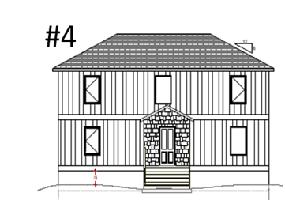
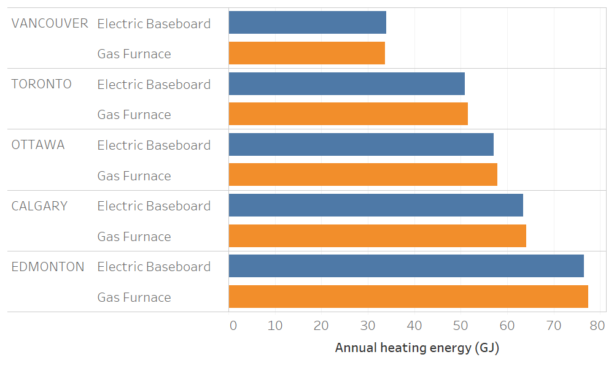
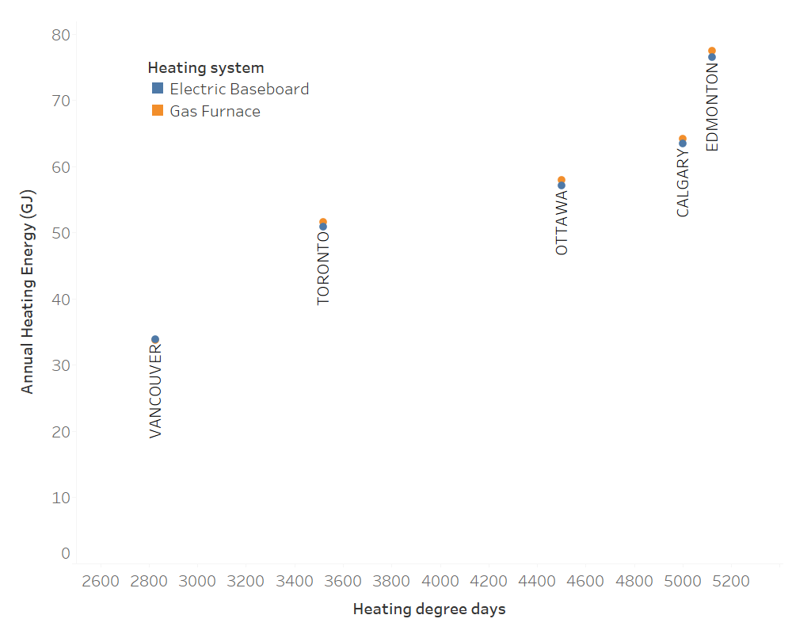

# Example Project Documentation #

>  Alex Ferguson (alex.ferguson@canada.ca)<br />CanmetENERGY-Ottawa, Natural Resources Canada
>
>  Version of May 27, 2019. <br />This is an example HTAP-project.  . <br />


## Background ##

This is a simple example intended to serve as a template for other users who wish to add projects to the HTAP projects repository

#### Objectives: ####

1. Illustrate use of markdown as a way to format documentation in the HTAP-projects repository, using a simple HTAP analysis task

#### Guiding principles: ####


## Method: ##

CE-O researchers used HTAP to examine an archetype's heating loads in five different cities, when constructed to the NBC 9.36 requirements for gas and electric heating. 

### Single Family Housing Archetype ###

For this analysis, CE-O researchers used NRCan archetype #4.

|  Archetype #4: 2100 sq ft detached ome   |
| :--------------------------------------: |
|  |


## Findings: ##

### 1. Variation in heating load by city ###

Figure 1 shows how heating loads vary by city:

|        Figure 1: Heating loads b         |
| :--------------------------------------: |
|  |

Figure 2 shows how heating loads vary by heating degree days.

|      Figure 2: Heating loads by Hea      |
| :--------------------------------------: |
|  |


## HTAP instructions: ##

The working files used in this analysis are stored in the HTAP-Projects Github repository: https://github.com/NRCan-IETS-CE-O-HBC/HTAP-projects/ . The branch `master` contains the relevant HTAP and HOT2000 files. 

HTAP users can recreate this analysis via the following command:

```powershell
> C:\HTAP\htap-prm.rb -r .\example.run -o C:\htap\HTAP-options.json -v -t 10 -j -c
```

Example output:

```
____________________________________________________________________________________________
= htap-prm: A simple parallel run manager for HTAP =========================================

 GitHub source:
    - Branch:   master
    - Revision: b38a57b

 Initialization:
    - Reading HTAP run definition from .\example.run...  done.
    - Evaluating combinations for parametric run

          * 5           { # of options for Location }
          * 1           { # of options for Archetypes }
          * 2           { # of options for Rulesets }
          *   (    1          { base option for all choices }
               )
          ----------------------------------------------------------
           10              Total combinations

    - Creating parametric run for 10 combinations --- 10 combos created.
    - Guesstimated time requirements ~ 16 seconds (including pre- & post-processing)

    ? Continue with run ? [yes] Y

    - Deleting prior HTAP-work directories...  done.
    - Deleting prior HTAP-sim directories...  done.
    - Preparing to process 10 generated combinations using 10 threads


____________________________________________________________________________________________
= htap-prm: Begin Runs =====================================================================

   + Batch 1 ( 0.0% done, 0/10 files processed so far ...)
     - Starting thread 1/10 for sim #1 (PID 13956)... done.
     - Starting thread 2/10 for sim #2 (PID 17788)... done.
     - Starting thread 3/10 for sim #3 (PID 7172)... done.
     - Starting thread 4/10 for sim #4 (PID 23588)... done.
     - Starting thread 5/10 for sim #5 (PID 17336)... done.
     - Starting thread 6/10 for sim #6 (PID 512)... done.
     - Starting thread 7/10 for sim #7 (PID 25608)... done.
     - Starting thread 8/10 for sim #8 (PID 5028)... done.
     - Starting thread 9/10 for sim #9 (PID 24736)... done.
     - Starting thread 10/10 for sim #10 (PID 23856)... done.
     - Waiting on PID: 13956 (1/10)... done.
     - Waiting on PID: 17788 (2/10)... done.
     - Waiting on PID: 7172 (3/10)... done.
     - Waiting on PID: 23588 (4/10)... done.
     - Waiting on PID: 17336 (5/10)... done.
     - Waiting on PID: 512 (6/10)... done.
     - Waiting on PID: 25608 (7/10)... done.
     - Waiting on PID: 5028 (8/10)... done.
     - Waiting on PID: 24736 (9/10)... done.
     - Waiting on PID: 23856 (10/10)... done.
     - Reading results files from PID: 13956 (1/10)... done.
     - Reading results files from PID: 17788 (2/10)... done.
     - Reading results files from PID: 7172 (3/10)... done.
     - Reading results files from PID: 23588 (4/10)... done.
     - Reading results files from PID: 17336 (5/10)... done.
     - Reading results files from PID: 512 (6/10)... done.
     - Reading results files from PID: 25608 (7/10)... done.
     - Reading results files from PID: 5028 (8/10)... done.
     - Reading results files from PID: 24736 (9/10)... done.
     - Reading results files from PID: 23856 (10/10)... done.
     - Post-processing results:
        -> Writing csv output output to HTAP-prm-output.csv ... done.
        -> Writing JSON output to HTAP-prm-output.json... done.
     - Batch processing time: 79 seconds.

 - HTAP-prm: runs finished -------------------------

 - Deleting working directories... done.

 - HTAP-prm: Run complete -----------------------

    + 10 files were evaluated successfully.

    + 0 files failed to run

____________________________________________________________________________________________
= htap-prm: Run Summary ====================================================================

 Total processing time: 90.48 seconds
 -> Informational messages:

   (nil)

 -> Warning messages:

   (nil)

 -> Error messages:

   (nil)

 STATUS: Task completed successfully
============================================================================================
```


